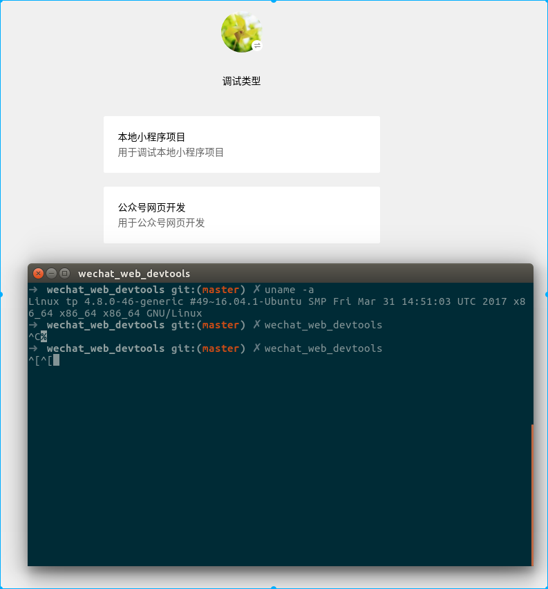
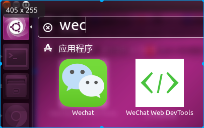
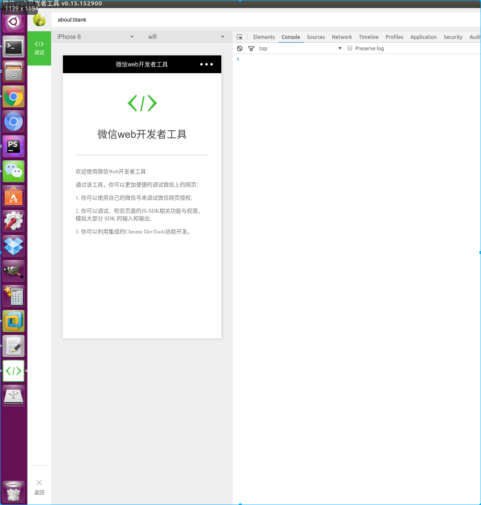

## WeChat Web DevTools 是什么？
WeChat Web DevTools 是腾讯官方提供用于微信 Web 开发和微信小程序开发的工具，由于官方只提供了 Windows 和 MacOS 版的工具，很多 Linux 爱好者很苦恼，所以我就折腾了半天把成功贡献给大家

<p align="center">
<a href="https://github.com/yuan1994/wechat_web_devtools"></a>
</p>

应码友要求，现分离出核心版本，核心版本不包含 nwjs，体积大大减小，需要使用核心版本的请移步 https://github.com/yuan1994/wechat_web_devtools/tree/core

## 下载安装
### 阿里云OSS下载(推荐)：
```
wget http://oss.yuan1994.com/github/wechat_dev_tools/latest/wechat_web_devtools.tar.gz
tar -zxvf wechat_dev_tools.tar.gz
```
或者直接下载：http://oss.yuan1994.com/github/wechat_dev_tools/latest/wechat_web_devtools.tar.gz

### composer安装：
```
composer create-project yuan1994/wechat_web_devtools wechat_web_devtools  --prefer-dist
```

> 本人是玩 PHP 的，别拍我 ^_^

### git克隆：
git clone https://github.com/yuan1994/wechat_web_devtools

### 直接下载：
https://github.com/yuan1994/wechat_web_devtools/archive/master.zip

## 开始使用
### 一键安装
```
cd /path/to/wechat_web_devtools
./install.sh <install_path>
```
执行 `./install.sh` 命令时请不要使用 `sudo`，待会儿会提醒你输入密码的，否则会导致应用用户组错误
`<install_path>` 为安装路径，例如 `/home/tianpian/software`，默认为 `/opt/tencent` 

### 按步骤安装
1. 将下载后的安装包改名为 wechat_web_devtools
```
mv wechat_web_devtools-master wechat_web_devtools
```
> 直接使用 git 克隆或者 composer 安装的可以省去此步骤，因为下载后的文件名就是 wechat_web_devtools

2. 创建文件夹
```
sudo mkdir /opt/tencent/
```

3. 移动文件
```
sudo mv ./wechat_web_devtools /opt/tencent
```

4. 修改用户组
```
sudo chown -R tianpian:tianpian /opt/tencent/wechat_web_devtools
```
> 请将上面的 tianpian 改成你自己当前用户的用户名，否则开发者工具运行时会提示无权限

5. 启动软件
```
/opt/tencent/wechat_web_devtools/nw
```

至此最新版微信开发者工具就能正常运行啦，如果有问题请提交 issues ，请上传截图或者粘贴上终端的错误信息

> 以上命令都在 ubuntu 14.04 上测试通过

## 快捷启动
### 桌面快捷启动图标（在 ubuntu 14.04 系统上测试的）
移动快捷启动图标到系统里即可
```
sudo cp /opt/tencent/wechat_web_devtools/wechat_web_devtools.desktop /usr/share/applications/
```
然后按下 Windows 键，左上角输入软件名称 Wechat Web DevTools，点击图标启动即可

### 终端启动
```
// 建立软链接
sudo ln -s /opt/tencent/wechat_web_devtools/nw /usr/local/bin/wechat_web_devtools
// 使用命令启动
wechat_web_devtools &
```
> 推荐启动时加入 & 符号，这样可以启用后台进程，启动后等待终端输出信息后再回车一次，这样就可以解放一个终端了

## 微信开发工具老版本
微信开发工具 v0.7.0 支持移动调试，但以后的版本不支持了，为了在一台机器上使用多个微信开发工具，可以找到 `package.json`，将 `package.json` 文件中的 `name` 和 `appname` 都改名，例如在后面加一个 old，该方法在 Linux\MacOS\Windows 都适用， Linux 版 v0.7.0　请移步 https://github.com/yuan1994/wechat_web_devtools/tree/v0.7.0

> 本人是 Linux 小白，如果有错误的地方或可以修改的地方请大神指教，欢迎大神拍砖

## 免责声明
该微信开发者工具系腾讯旗下产品，版权归腾讯公司所有，如果版权侵犯请联系我






